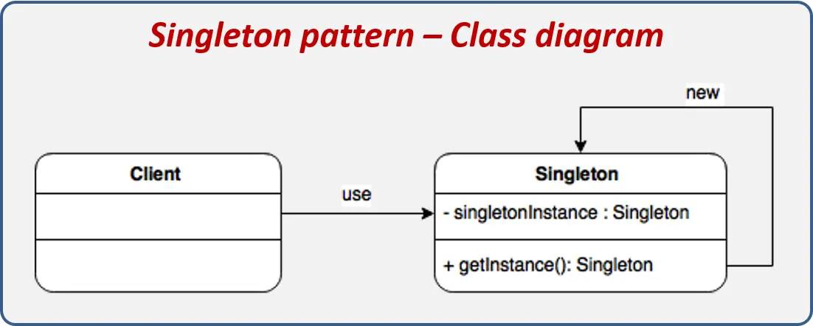

# Spring Boot

## POO Fundamentals

### Herencia

Es un mecanismo mediante el cual una clase (denominada clase hija o subclase) hereda atributos y métodos de otra clase (llamada clase padre o superclase). Esto permite reutilizar código, facilitando la creación de nuevas clases que extienden la funcionalidad de las existentes sin tener que reescribirlas.

### Polimorfismo

El polimorfismo es la capacidad de un objeto de tomar diferentes formas o comportamientos en función del contexto en el que se utilice. En POO, esto se logra mediante la sobrescritura de métodos en clases hijas, lo que permite que un objeto de una clase hija se trate como un objeto de su clase padre. Esto permite escribir código más flexible y reutilizable. En otras palabras, permite que diferentes clases tengan métodos con el mismo nombre pero con comportamientos diferentes.

En POO, este concepto se aplica principalmente de dos formas:

1.  **Sobrescritura (Method Overriding):** Es el polimorfismo en **tiempo de ejecución**. Permite que una subclase proporcione una implementación específica de un método que ya está definido en su clase padre. Es fundamental para que un objeto de una clase hija se comporte de manera única aun siendo tratado como un tipo de la clase padre.
2.  **Sobrecarga (Method Overloading):** Es el polimorfismo en **tiempo de compilación**. Permite definir múltiples métodos con el mismo nombre dentro de una clase, siempre que sus parámetros sean distintos (en número o tipo).

En resumen, la sobrescritura cambia el comportamiento de un método heredado, mientras que la sobrecarga ofrece múltiples formas de invocar un mismo comportamiento con diferentes datos.

### Encapsulamiento

El encapsulamiento es la práctica de ocultar los detalles internos de una clase y exponer solo una interfaz pública para interactuar con ella. Esto se logra mediante el uso de modificadores de acceso (public, private, protected) y propiedades (getters y setters). El encapsulamiento permite proteger los datos de una clase de ser modificados de manera inadecuada y facilita la evolución del código sin afectar a las partes que lo utilizan.

### Abstracción

La abstracción es el proceso de ocultar los detalles internos de implementación y mostrar solo lo esencial o relevante de un objeto para el usuario. Facilita la creación de sistemas más complejos simplificando cóm o los componentes interactúan entre sí. Por ejemplo, al usar una clase Guante no necesitamos conocer cómo funcionan internamente las gemas, solo cómo usarlas mediante sus métodos expuestos.

#### Reutilización de código

Permite que las subclases reutilicen los atributos y métodos de la superclase, evitando duplicidad de código.

#### Facilidad de mantenimiento

Al tener un punto centralizado (superclases), cualquier cambio se refleje automáticamente en las subclases que heredan de ella.

#### Extensibilidad

Las subclases pueden extender y personalizar el comportamiento de la superclase sin modificar su código base.

#### Desacopla el código

Facilita separar responsabilidades, permitiendo que las subclases manejen comportamientos específicos sin afectar la superclase.

#### Permite implementar patrones de diseño

Muchos patornes de diseño, como el Template Method, el Factory Method o el Decorator, aprovechan la herencia para definir estructuras reutilizables y escalables.

## Patrones de diseño usados por Spring

### Patrones de diseño

Es una solución reutilizable y comprobada para resolver problemas comunes de diseño de software. Facilita la organización del código, mejora la mantenibilidad y promueve buenas prácticas al proporcionar guías claras para situaciones recurrentes.

### Clasificación de los patrones de diseño

Los patrones de diseño se dividen en:

* Creacionales
* Estructurales
* Comportamiento

#### Creacionales

Se enfocan en la forma de crear objetos, permitiendo instancias flexibles y reutilizables. (Factory Method, Abstract Factory).

#### Estructurales

Se centran en la composición de clases y objetos para formar estructuras más grandes y flexibles. (Adapter, Composite, Facade).

#### Comportamiento

Definen cómo los objetos interactúan y se comunican entre sí. (Observer, Strategy, Command).

### Ejemplos en Spring Framework

*   **Singleton:** Spring gestiona los beans por defecto como instancias únicas (Scope Singleton).
*   **Dependency Injection (Inversión de Control):** Permite desacoplar la creación de objetos de su uso, facilitando la testabilidad y el mantenimiento.
*   **Proxy:** Utilizado en la Programación Orientada a Aspectos (AOP) para el manejo de transacciones (@Transactional).
*   **Template Method:** Como se ve en `JdbcTemplate` o `RestTemplate`, donde Spring maneja el flujo repetitivo y el desarrollador solo provee la lógica específica.

### Singleton

Es un patrón de diseño creacional que garantiza que una clase tenga una única instancia en toda la aplicación y proporciona un punto de acceso global a esa instancia. Este patrón es útil cuando se necesita un objeto compartido, como un logger o una conexión a base de datos.

Características claves:

* Instancia única: Solo se crea una instancia durante la ejecución del programa.
* Acceso global: La instancia es accesible desde cualquier parte del código.
* Control sobre la instancia: El constructor suele ser privado y el acceso se hace a través de un método estático.

